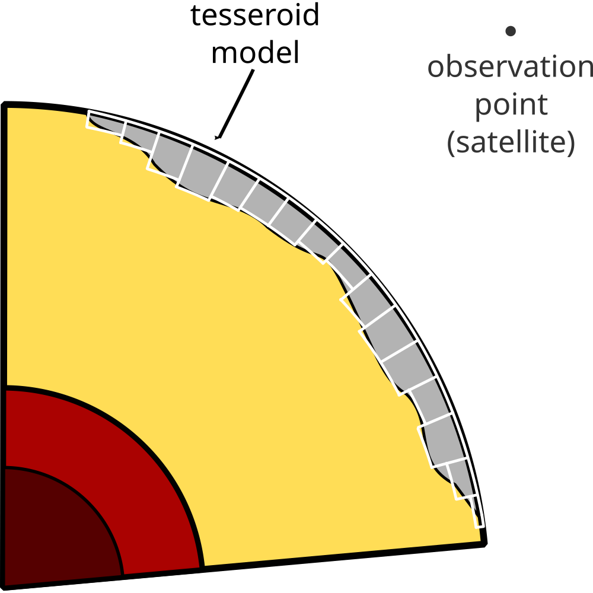
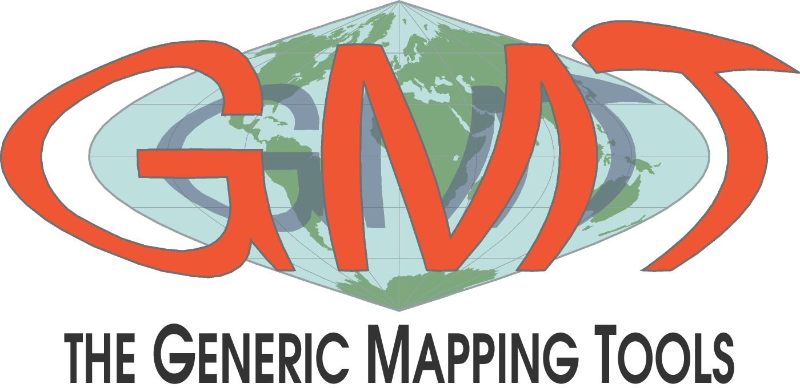
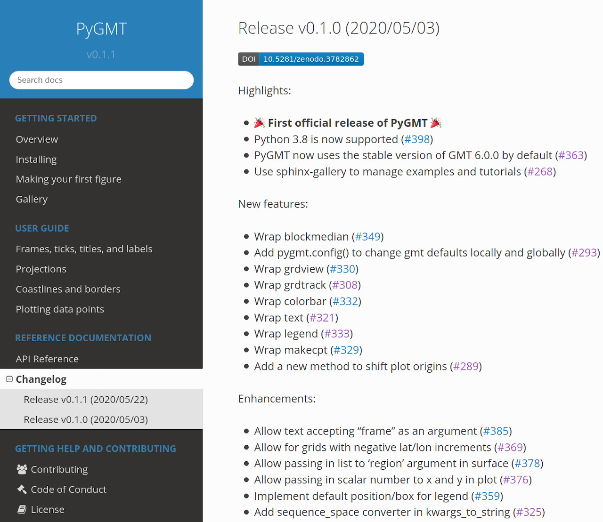
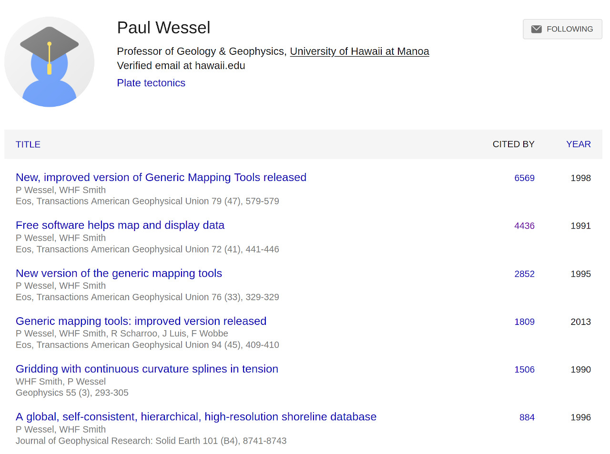
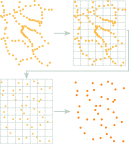
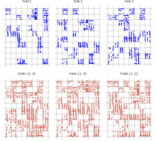
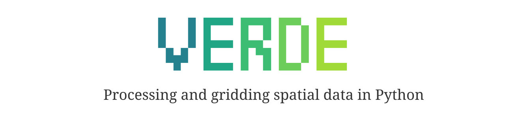
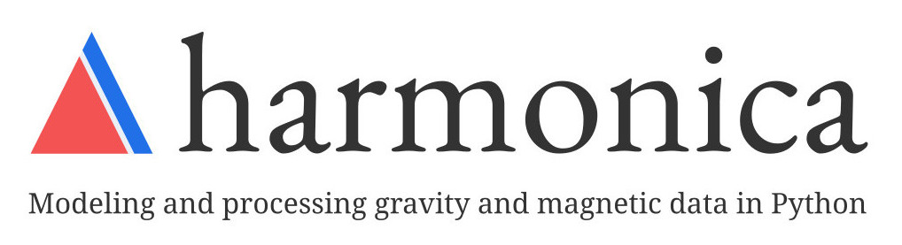

<!-- .slide: class="slide-title" data-background-image="img/title-slide-background.jpg" data-background-opacity="0.25" data-background-color="#000000" -->

<div class="centered">
<div>

# Geophysical research powered by open-source

## [Leonardo Uieda](https://www.leouieda.com)

[www.leouieda.com](https://www.leouieda.com)
<span style="margin: 0 20px"></span>
[<i class="fab fa-twitter fa-small"></i> @leouieda](https://twitter.com/leouieda)

Institute of Geophysics and Geoinformatics, Technische Universität Bergakademie Freiberg

4 June 2020

<div class="container">
<div class="col-left">

[](https://www.compgeolab.org)

</div>
<div class="col-right">

[](https://www.liverpool.ac.uk/earth-ocean-and-ecological-sciences/)

</div>
</div>

<div class="title-license">

[<i class="fab fa-creative-commons"></i><i class="fab fa-creative-commons-by"></i> CC-BY 4.0](https://creativecommons.org/licenses/by/4.0/)
<span style="margin: 0 20px">|</span>
<i class="fa fa-camera"></i> Feel free to share/photograph this presentation

</div>

</div>
</div>

---

<div class="centered">
<div class="huge">

1. Why software **best practices** are important
2. How investing in software can benefit **science**
3. What you can do about it **today**

</div>
</div>

---

<!-- .slide: class="slide-transition" data-background-color="rgb(25, 34, 55)" -->

<div class="centered">
<div>

# My Background

*A tale of three projects*

</div>
</div>

---

<!-- .slide: data-background-video="video/brasil-sao-paulo-rio.mp4" data-background-size="cover" -->

<div class="r-stretch bottom-left">

BSc in Geophysics from Universidade de São Paulo |
MSc + PhD in Geophysics from Observatório Nacional in Rio

</div>

---

<!-- .slide: data-background-image="img/first-contact-with-c.jpg" data-background-size="cover" -->

<div class="r-stretch bottom-right">

16 years later and the code actually compiled on my first try!

</div>

---

<!-- .slide: data-background-image="img/paleomagnetism-field-work.jpg" data-background-size="cover" -->

<div class="r-stretch bottom-left">

Brief stint as a paleomagnetist getting stung by hornets.
Don't judge the hair, I was 19.

</div>

---

<div class="centered">
<div>

## Project #1


*C command-line programs for gravity modelling*

[`tesseroids.leouieda.com`](https://tesseroids.leouieda.com)

</div>
</div>

---

<div class="container">
<div class="col-left">


## Support for future GOCE data

<br>

Collaboration between
<br>
Naomi Ussami (USP),
<br>
Carla Braitenberg (Trieste),
<br>
and  Valéria Barbosa (ON).

</div>
<div class="col-right">



</div>
</div>

<div class="bottom-left">

Uieda, Barbosa, Braitenberg (2016) |
doi:[10.1190/geo2015-0204.1](https://doi.org/10.1190/geo2015-0204.1)

</div>

---

<div class="centered">
<div>

## Project #2


*Libraries for modelling, inversion, data processing, etc.*

[`www.fatiando.org`](https://www.fatiando.org)

</div>
</div>

---

<!-- .slide: data-background-image="img/fatiando-first-gallery.jpg" data-background-size="cover" -->

<div class="r-stretch bottom-right bottom-dark">

Started in 2010 as a mixed bag of geophysics in Python.
<br>
First website and example gallery from 2011. (Google+ &#x1f602;)

</div>

---

<!-- .slide: data-background-video="video/seismic-waves-demo.mp4" data-background-size="cover" -->

<div class="r-stretch bottom-right bottom-dark">

Used extensively in **teaching** at [UERJ](https://www.uerj.br/) and
**research** at the [PINGA Lab](https://www.pinga-lab.org/)

</div>

---

<!-- .slide: data-background-image="img/fatiando-tools.svg" data-background-size="cover" -->

<div class="r-stretch bottom-right">

In 2018 started a complete rewrite of Fatiando a Terra,
<br>
breaking into separate tools.

</div>

---

<div class="container">
<div class="col-left">


<p style="text-align: center;">
<a href="https://santisoler.github.io/">Santiago Soler<br>@santisoler</a>
</p>

</div>
<div class="col-right">

## Breath of fresh air

* PhD student from Argentina
* Collaborating since 2015
* Inspired writing down my process
* Leading some of our new packages (Harmonica and RockHound)
* Main force behind many new developments

</div>
</div>

---

<!-- .slide: data-background-video="video/run-away-to-hawaii.mp4" data-background-size="cover" -->

<div class="r-stretch bottom-left">

Postdoct at University of Hawai'i working on the Generic Mapping Tools (GMT)

</div>

---

<div class="centered">
<div>

## Project #3



*Command-line tool for mapping/processing geophysical data*

[`www.generic-mapping-tools.org`](https://www.generic-mapping-tools.org)

</div>
</div>

---

## PyGMT: Bringing GMT to Python

<div class="container">
<div class="col-large">

```python
import pygmt

# Load built-in topography data
grid = pygmt.datasets.load_earth_relief()

fig = pygmt.Figure()
# Pseudo-color map of topography
fig.basemap(
    region=[-150, -30, -60, 60],
    projection="I-90/6i",
    frame=True,
)
fig.grdimage(grid=grid, cmap="viridis")
# Mask continents in dark grey
fig.coast(land="#333333")
# Display in Jupyter or pop-up window
fig.show()
```

</div>
<div class="col-small">


<div class="r-stretch bottom-center">

My [initial role in Hawai'i](https://www.leouieda.com/blog/hawaii-gmt-postdoc.html)
was creating [PyGMT](https://www.pygmt.org/).

</div>

</div>
</div>

---

<div class="container">
<div class="col-large">



<div class="r-stretch bottom-left">

The [first official release of PyGMT](https://www.pygmt.org/latest/changes.html#release-v0-1-0-2020-05-03)
was managed by Wei Ji and Dongdong.

</div>

</div>
<div class="col-small">

### A community developed project

Contributors to v0.1.0:

<div class="container" style="margin-top: 5%">
<div class="col-left tiny">

* Dongdong Tian
* Wei Ji Leong
* Leonardo Uieda
* Liam Toney
* Brook Tozer

</div>
<div class="col-right tiny">

* Claudio Satriano
* Cody Woodson
* Mark Wieczorek
* Philipp Loose
* Kathryn Materna

</div>
</div>

</div>
</div>

---

<!-- .slide: data-background-image="img/gmt-summit-2019-names.jpg" data-background-size="cover" data-background-position="top" -->

<div class="r-stretch bottom-left">

GMT started in the 80s by Paul Wessel and Walter Smith.
Photo from the 2019 GMT Summit at Scripps.

</div>

---

<!-- .slide: data-background-image="img/hawaii-sunset.jpg" data-background-opacity="0.25" data-background-color="#000000" -->

### How Paul can retire in peace &#x1F3DD;

<ul class="fa-ul">
<li>
  <i class="fa-li fab fa-github fa-fw"></i>
  Lower barriers to contribution
</li>
<li>
  <i class="fa-li fas fa-robot fa-fw"></i>
  Automate as much as possible
</li>
<li>
  <i class="fa-li fa fa-users fa-fw"></i>
  Nurture a community of users/developers
</li>
<li>
  <i class="fa-li fas fa-university fa-fw"></i>
  Formalize project governance
</li>
<li>
  <i class="fa-li fas fa-code fa-fw"></i>
  General house cleaning of the code
</li>
<li class="fragment">
  <i class="fa-li fa fa-dollar-sign fa-fw"></i>
  new NSF grant to fund this
  &#x1F389;
  (ID: <a href="https://www.nsf.gov/awardsearch/showAward?AWD_ID=1948602">1948602</a>)
<div class="bottom-left bottom-dark" style="margin-top: 3%;">

Proposal is public at
[doi.org/10.6084/m9.figshare.12235727](https://doi.org/10.6084/m9.figshare.12235727)

</div>
</li>
</ul>

---

<!-- .slide: data-background-video="video/hawaii-to-liverpool.mp4" data-background-size="cover" -->

<div class="r-stretch bottom-left">

Lecturer of Geophysics at the University of Liverpool from 2019

</div>

---

<!-- .slide: data-background-image="img/title-slide-background.jpg" data-background-opacity="0.35" data-background-color="#000000" -->

<div class="centered">
<div>

<a href="https://www.compgeolab.org">

</a>

## Geophysics + Open-source

Building **methods and software** foundations to power

**scalable**
gravity and magnetics **processing and inversion**

</div>
</div>

---

<!-- .slide: data-background-image="img/Wikimedia_Foundation_Servers-8055_35.jpg" data-background-opacity="0.2" data-background-color="#000000" -->

## Code is essential to research

<div class="container">
<div class="col-left">

Data processing, analysis, visualization, inference, etc.

<br>

**Computers are always involved somehow.**

</div>
<div class="col-right">

Machine learning is <br> open-source:

* [scikit-learn](https://scikit-learn.org/)
* [TensorFlow](https://www.tensorflow.org/) (Google)
* [PyTorch](https://pytorch.org/) (Facebook)
* [RAPIDS](https://rapids.ai/) (NVIDIA)

</div>
</div>

<div class="r-stretch bottom-left bottom-dark">

Image by
Victor Grigas
([CC-BY-SA](https://commons.wikimedia.org/wiki/File:Wikimedia_Foundation_Servers-8055_35.jpg))

</div>

---

<!-- .slide: class="slide-transition" data-background-color="rgb(25, 34, 55)" -->

<div class="centered">
<div>

# Why best practices <br> are important

*Horror stories of public embarassment and backlash*

</div>
</div>

---

<!-- .slide: data-background-image="img/reinhart-rogoff-error.jpg" data-background-opacity="1" data-background-color="#000000" -->

<div class="r-stretch bottom-left bottom-dark">

Published in *The Conversation*
([CC-BY-ND](https://theconversation.com/the-reinhart-rogoff-error-or-how-not-to-excel-at-economics-13646))

</div>

---

<!-- .slide: data-background-image="img/reinhart-rogoff-error.jpg" data-background-opacity="0.2" data-background-color="#000000" -->


<div class="r-stretch quote">

“The most serious was that, in their Excel spreadsheet, Reinhart and Rogoff had
**not selected the entire row** when averaging growth figures...”


</div>

<div class="bottom-left bottom-dark">

Published in *The Conversation*
([CC-BY-ND](https://theconversation.com/the-reinhart-rogoff-error-or-how-not-to-excel-at-economics-13646)).
Emphasis are my own.

</div>

---

<!-- .slide: data-background-image="img/reinhart-rogoff-error.jpg" data-background-opacity="0.2" data-background-color="#000000" -->


<div class="r-stretch quote">

"So the **key conclusion** of a seminal paper, which has been **widely quoted
in political debates** in North America, Europe, Australia and elsewhere, was
**invalid**."

</div>

<div class="bottom-left bottom-dark">

Published in *The Conversation*
([CC-BY-ND](https://theconversation.com/the-reinhart-rogoff-error-or-how-not-to-excel-at-economics-13646)).
Emphasis are my own.

</div>

---

<!-- .slide: data-background-image="img/ferguson-modelling-code.jpg" data-background-opacity="1" data-background-color="#000000" -->

<div class="r-stretch bottom-left bottom-dark">

Published in [*Software Sustainability Institute* blog](https://www.software.ac.uk/blog/2020-06-01-critique-software-understand-constraints-its-written-under)

</div>

---

<!-- .slide: data-background-image="img/ferguson-modelling-code.jpg" data-background-opacity="0.2" data-background-color="#000000" -->

<div class="r-stretch quote">

"When Ferguson tweeted on 22 March that he "wrote the code (**thousands of
lines of undocumented C**) 13+ years ago to model flu pandemics", the debate
expanded to include the work's age, robustness and applicability to
coronavirus.

</div>

<div class="bottom-left bottom-dark">

Published in [*Software Sustainability Institute* blog](https://www.software.ac.uk/blog/2020-06-01-critique-software-understand-constraints-its-written-under).
Emphasis are my own.

</div>

---

<!-- .slide: data-background-image="img/ferguson-modelling-code-github.jpg" data-background-opacity="0.5" data-background-color="#000000" -->

<div class="r-stretch quote">

"We, the undersigned software engineers, call for any papers
<br>
based on this codebase to be immediately retracted"

</div>

<div class="bottom-left bottom-dark">

Comment in the code repository on GitHub [mrc-ide/covid-sim#165](https://github.com/mrc-ide/covid-sim/issues/165)

</div>

---

<div class="centered">
<div>

## Earth Science is also in the public gaze


Today's quick hack can become the foundation for

tomorrow's climate change policy.


</div>
</div>

---

<div class="container">
<div class="col-large">



</div>
<div class="col-small">

## Not all is grim

* Good software gets **used**
* Used software generates citations and collaborations
* Potential impact of software is huge
* It's never too late to start
* ...until it is

</div>
</div>

<div class="r-stretch bottom-left">

Paul's [Google Scholar page](https://scholar.google.com/citations?user=sRaRFxIAAAAJ&hl=en&oi=ao#)
tracks over 18000 citations related to GMT.

</div>

---

<!-- .slide: class="slide-transition" data-background-color="rgb(25, 34, 55)" -->

<div class="centered">
<div>

# Open software <br> benefits science

*Success stories of past, present, and future*

</div>
</div>

---

<div class="centered">
<div>

# Past

</div>
</div>

---

<!-- .slide: data-background-image="img/tesseroids-usage-goce.jpg" -->

<div class="r-stretch bottom-left bottom-dark">

Bouman et al. (2016) | doi:[10.1038/srep21050](https://doi.org/10.1038/srep21050)

</div>

---

<!-- .slide: data-background-image="img/tesseroids-usage-goce.jpg" data-background-opacity="0.2" data-background-color="#000000" -->

<div class="r-stretch quote">

"The signal has been calculated for the spherical geometry with the software
*Tesseroids*"

</div>

<div class="bottom-left bottom-dark">

Bouman et al. (2016) | doi:[10.1038/srep21050](https://doi.org/10.1038/srep21050)

</div>

---

<!-- .slide: data-background-image="img/moho-south-america-repository.jpg" -->

<div class="r-stretch bottom-left bottom-dark">

Code (built on Fatiando a Terra) and data [published on
GitHub](https://github.com/pinga-lab/paper-moho-inversion-tesseroids).
Uieda & Barbosa (2017) | doi:[10.1093/gji/ggw390](https://doi.org/10.1093/gji/ggw390).

</div>

---

<!-- .slide: data-background-image="img/moho-south-america-repository.jpg" data-background-opacity="0.2" data-background-color="#000000" -->

<div class="r-stretch quote">

**Studies using the code:**
<br>
Antarctica (Chisenga et al., 2019; Pappa et al., 2019)
<br>
Egypt (Sobh et al., 2019)
<br>
Atlas (Ghomsi et al., 2019)
<br>
China (Chisenga and Yan, 2019)
<br>
Cameroon (Ghomsi et al., 2020)

</div>

<div class="bottom-left bottom-dark">

Code (built on Fatiando a Terra) and data [published on
GitHub](https://github.com/pinga-lab/paper-moho-inversion-tesseroids).
Uieda & Barbosa (2017) | doi:[10.1093/gji/ggw390](https://doi.org/10.1093/gji/ggw390).

</div>

---

<div class="centered">
<div>

# Present

</div>
</div>

---

## Equivalent source processing

<div class="container">
<div class="col-large">


</div>

<div class="col-small">

Linear model used to make predictions:

* interpolation/gridding
* reduction-to-the-pole
* upward-continuation
* derivatives
* and more

</div>
</div>

<div class="r-stretch bottom-left">

Soler & Uieda (2020) | doi:[10.5194/egusphere-egu2020-549](https://doi.org/10.5194/egusphere-egu2020-549).

</div>

---

## Challenge: Computationally heavy

<div class="container">
<div class="col-left">



</div>

<div class="col-right">

Block-averaging source positions
can **reduce** number of sources by 1/2 to 1/5
with **same interpolation accuracy**.

</div>
</div>

<div class="r-stretch bottom-right">

Soler & Uieda (2020) | doi:[10.5194/egusphere-egu2020-549](https://doi.org/10.5194/egusphere-egu2020-549).

</div>

---

## Challenge: Source depth, damping, etc

<div class="container">
<div class="col-left">



</div>

<div class="col-right">

**Cross-validation** is the gold standard in machine learning.

**Underestimates** accuracy scores for spatial data.

**Block (spatial) cross-validation** resolves this issue.

</div>
</div>

<div class="r-stretch bottom-right">

Roberts et al. (2017) | doi:[10.1111/ecog.02881](https://doi.org/10.1111/ecog.02881)
<br>
Uieda & Soler (2020) | doi:[10.5194/egusphere-egu2020-15729](https://doi.org/10.5194/egusphere-egu2020-15729).

</div>

---

<div class="container">
<div class="col-left">


</div>

<div class="col-right">

## Beyond gravity and magnetics

Interpolate and merge 3D velocities from
**GPS and InSAR**

Used to calculate strain rate for **tectonics and geohazards**

**Large data** volumes from InSAR

</div>
</div>

<div class="r-stretch bottom-right">

Uieda & et al. (2018) | doi:[10.6084/m9.figshare.7440683](https://doi.org/10.6084/m9.figshare.7440683).

</div>

---

<div class="centered">
<div>

# Future

</div>
</div>

---

## Automated, parallel, scalable

<div class="container">
<div class="col-large">

Equivalent-sources on large data:

* Parallel cross-validation (done)
* Reduce memory usage (done in part)
* Parallel least-squares
* Efficient machine learning methods
* Multiple different datasets
* Scale in the cloud ([Pangeo](https://pangeo.io/))

</div>
<div class="col-small" style="text-align: center;">

Built on open-source:





</div>
</div>

---

<!-- .slide: class="slide-transition" data-background-color="rgb(25, 34, 55)" -->

<div class="centered">
<div>

# What you <br> can do now

*(with limited time and money)*

</div>
</div>

---

## Value software work

1. In your own lab/department/university
1. In grant evaluations, job searches, awards
1. Be kind and respectful to developers
1. Cite the software you use\*
1. Encourage others to do the same

<div class="r-stretch bottom-right">

\* See ["Software citation principles"](https://doi.org/10.7717/peerj-cs.86) by
Smith et al. (2016)

</div>

---

## Get credit for your code


*Open-access (free) developer-friendly journal*

[`joss.theoj.org`](https://joss.theoj.org/)

<div class="r-stretch bottom-right">

I'm a topic editor for geophysics and [there are many
others](https://joss.theoj.org/about#topic_editors)
|
JOSS logo licensed [CC-BY-4.0](https://github.com/openjournals/digital-assets)

</div>

---

<!-- .slide: data-background-image="img/agu2018workshop.jpg" data-background-opacity="0.25" data-background-color="#000000" -->

## Train in best practices

* [Software Carpentry](https://software-carpentry.org)
* [AGU Workshops](https://github.com/agu-ossi)
* [Software Sustainability Institute (SSI)](https://www.software.ac.uk/)
* [US Research Software Sustainability Institute (URSSI)](http://urssi.us/)
* [Better Scientific Software](https://bssw.io/)
* Contribute to a project (code, docs, examples, etc)

---

<!-- .slide: class="slide-transition" data-background-color="rgb(25, 34, 55)" -->

<div class="centered">
<div>

# Conclusions

</div>
</div>

---

<!-- .slide: class="slide-conclusions" -->

## Main takeaways

<ol>
<li class="fragment">

**Treat code as you would data** <br> *be skeptical, diligent, careful*

</li>
<li class="fragment">

**Learn "good-enough" practices** <br> *to safely handle code*

</li>
<li class="fragment">

**One step at a time** <br> *do what can be done right now*

</li>
<li class="fragment">

**Value good software** <br> *with credit, money, and time*

</li>
</ol>

---

<!-- CONTACT -->
<!-- ====================================================================== -->

<!-- .slide: class="slide-contact" data-background-image="img/liverpool.jpg" data-background-position="top" data-background-opacity="0.25" data-background-color="#000000" -->

<div class="centered">
<div>

# Contact

<ul class="fa-ul" style="">
<li><i class="fa-li fa fa-envelope"></i>

[Leonardo.Uieda@liverpool.ac.uk](mailto:Leonardo.Uieda@liverpool.ac.uk)

</li>
<li><i class="fa-li fab fa-twitter"></i>

[@leouieda](https://twitter.com/leouieda)

</li>
<li><i class="fa-li fa fa-desktop"></i>

[www.leouieda.com](https://www.leouieda.com)

</li>
<li><i class="fa-li fa fa-flask"></i>

[www.compgeolab.org](https://www.compgeolab.org)

</li>
</ul>

</div>
</div>

---

<!-- LICENSE -->
<!-- ====================================================================== -->

<!-- .slide: class="slide-license" -->

<div class="centered">
<div>

<p class="license-icons">
<i class="fab fa-creative-commons"></i><i class="fab fa-creative-commons-by"></i>
</p>

This presentation is licensed under

[Creative Commons Attribution 4.0 International](https://creativecommons.org/licenses/by/4.0/)

</div>
</div>
